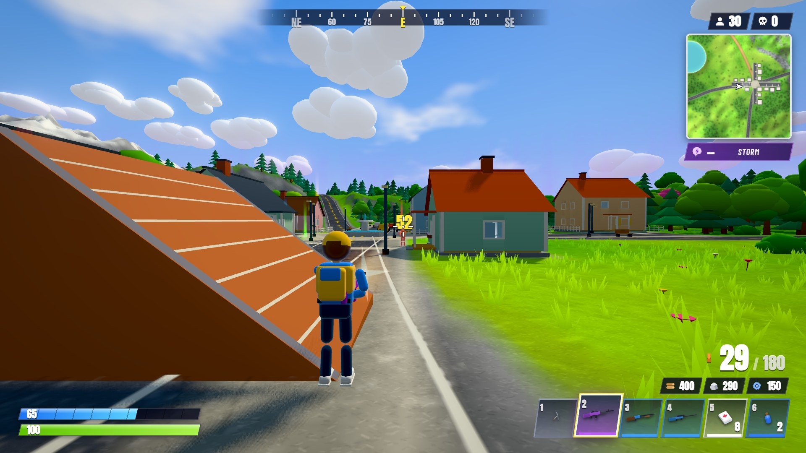
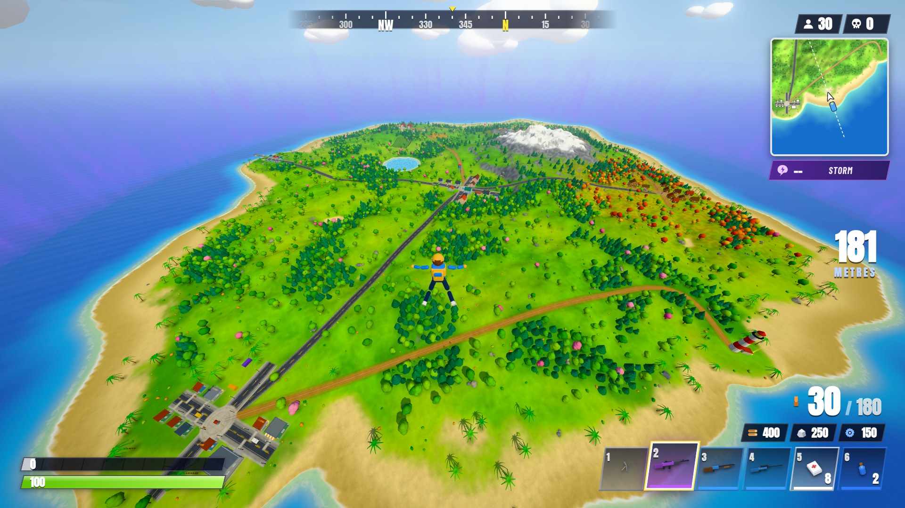
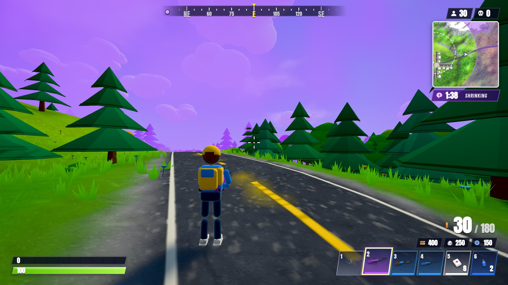

# ⚡ Stormfall Royale

A **third-person battle royale that runs entirely in your browser** — no install, no assets, no server logic.
Drop from the Sky Bus onto a colourful island, loot weapons, build walls and ramps, and outlast 29 bots while the storm closes in.

> Unofficial fan-made homage to the battle-royale genre. Not affiliated with, endorsed by, or connected to Epic Games.
> All art, sound and code are procedurally generated for this project.

<p align="center"></p>
<p align="center">
  
  
</p>

## Play it

**Fastest:** open [`dist/stormfall.html`](dist/stormfall.html) — a prebuilt, single self-contained file (engine, fonts and code inlined; works from disk or any static host).

```bash
npm install
npm run build      # bundles src/ → dist/game.js and dist/stormfall.html
npm start          # serves the repo at http://localhost:8080
```

Needs a desktop browser with WebGL2 (recent Chrome, Edge, Firefox or Safari), a mouse and a keyboard. Click **PLAY** — the game captures the mouse (pointer lock). If your browser refuses pointer lock (e.g. inside a sandboxed iframe) it falls back to free-look, and the arrow keys always turn the camera.

## Controls

| Action | Key |
| --- | --- |
| Move / sprint / jump / crouch | `W A S D` / `Shift` / `Space` / `C` |
| Fire / aim down sights | Left / Right mouse |
| Reload | `R` |
| Pick up / open chest | `E` |
| Select item | `1`–`6` or mouse wheel (slot 1 is the pickaxe) |
| Drop selected item | `G` |
| **Build mode** | `Q` (toggle) |
| Wall / Floor / Ramp / Roof | `Z` `X` `C` `V` (or `1`–`4` in build mode) — click to place, hold to keep placing |
| Cycle material (wood → stone → metal) | `R` in build mode |
| Inventory / Map (click to set waypoint) | `Tab` / `M` |
| Dance | `B` |
| Deploy glider | `Space` while skydiving |
| Pause | `Esc` |

## What's in the box

* **Battle royale loop** — Sky Bus flight, choose when to jump, skydive (look down to dive, level out to glide farther), auto-glider, landing, looting, fights, and a Victory Royale screen. 30 players by default (6–50 in Settings), three bot difficulties.
* **Third-person combat** — over-the-shoulder camera with camera collision, ADS zoom, sprint FOV kick, a scoped sniper view, recoil/bloom/spread, headshots, damage falloff, hit markers, floating damage numbers and directional damage indicators. Weapons: assault rifle, SMG, pump shotgun, bolt-action sniper, pistol, plus the pickaxe.
* **Loot & inventory** — Common → Legendary rarities with Fortnite-style colour-coded beams, chests, ammo boxes, bandages, med kits, mini/big shield potions and chug jugs. A 6-slot hotbar (item icons are rendered live from the 3D models), Tab inventory with drop buttons, ammo reserves by type and materials.
* **Health & shields** — shield absorbs damage first; healing items are hold-to-use and cancel when interrupted.
* **Building** — grid-snapped walls, floors, ramps and roofs in wood / stone / metal. Pieces anchor to a shared lattice, animate as they build, have HP, collide, block bullets and can be shot down or smashed with the pickaxe (no refunds — you can't farm your own walls). Ramp chains climb cleanly, floors sit on solid foundations over slopes, and invalid spots tell you why. Trees, rocks and cars are harvestable for materials.
* **Enemy bots** — they drop from the bus onto points of interest, path-find with A* over a lazily built navigation grid (through doors, around walls, fences and props; they climb down off roofs), loot, heal, run from the storm, pick weapons by range, strafe, jump, take cover behind self-built walls, and hunt gunshots. Skill and reaction time scale with difficulty.
* **The storm** — seven shrinking phases with growing damage that finish on a tiny final circle, a shader-driven wall (a faint haze on the horizon at first, a churning curtain up close), purple fog/sky tint and vignette when you're outside, a dashed next-circle ring on the minimap.
* **Minimap, compass & full map** — north-up minimap, compass bar with cardinal directions, and a full-screen map with POI names and click-to-place waypoints (with a 3D beacon in the world).
* **The island** — procedural terrain with beaches, lake, rolling hills and a snow-capped peak; six named towns (Meadowbrook, Sunny Harbor, Maple Hollow, Windy Acres, Pebble Cove, Pinecrest Lodge) with streets, houses you can walk into (some with stairs and second floors), shops, barns, warehouses, docks, a windmill, water tower and lighthouse; ~4,600 stylised trees, rocks, bushes, grass tufts and flowers.
* **Look & feel** — warm sun with soft shadows, hemisphere fill, tone-mapped HDR with bloom and colour grading, animated stylised water with foam, cloud dome plus chunky 3D clouds, wind-swayed foliage, procedurally animated characters (IK-driven hands, run/strafe/crouch/jump/land, reload, swing, heal, skydive, glide, swim, dance, death), slanted Fortnite-style HUD with condensed italic type.
* **Audio** — every sound is synthesised at runtime with WebAudio (per-weapon gunshots, reloads, impacts by material, footsteps, spatialised bot fire, storm rumble, chest hum, UI chimes…).
* **Performance** — chunked terrain and instanced scenery with distance LOD, pooled particles, adaptive resolution scaling (Settings → Graphics: Auto / High / Medium / Low).

## Project layout

```
index.html            page shell (loads dist/game.js)          scripts/build.mjs   esbuild bundle + single-file build
styles/main.css       HUD + menu styling                       scripts/serve.mjs   zero-dependency static server
src/
  game.js             Game: main loop, match flow, eliminations, victory
  config.js           tunables (world size, storm phases, rarities…)
  data/items.js       weapons, ammo, consumables, loot tables
  world/              terrain, painter, towns, buildings, props, scatter, grass, roads, water, sky, storm, bus
  physics/physics.js  spatial-hash colliders (boxes/cylinders/ramps), ground/ceiling queries, ray casts
  entities/           actor (movement), player, bot (AI), character model + animation, weapon controller, item models
  systems/            camera, combat, effects, loot, inventory, building, nav (bot pathfinding), audio, input
  ui/                 hud, menus, minimap/compass/map, icon renderer
scripts/smoke-test.mjs  headless end-to-end smoke test (npm test)
```

## Development

```bash
npm run dev      # rebuild on change (dev bundle with inline source maps)
npm test         # headless Chromium smoke test against dist/stormfall.html (run `npm run build` first):
                 # boot → bus → skydive → land → shoot / build / loot / harvest → a fresh 150 s match with real bots
```

Query-string switches (handy for testing): `?autostart=1` skips the title screen, `?loadout=1` gives a practice loadout, `?jumpnow=1` ejects you from the bus immediately, `?seed=N` fixes the match seed, `?quality=low|medium|high` forces a graphics preset, and `?manual=1` disables the automatic loop so tests can call `__game.simulate(seconds)` and `__game.render()` themselves.

## Credits

Built with [Three.js](https://threejs.org) and [esbuild](https://esbuild.github.io). UI type: [Anton](https://fonts.google.com/specimen/Anton) and [Barlow Condensed](https://fonts.google.com/specimen/Barlow+Condensed) (SIL Open Font License), embedded in the build.
